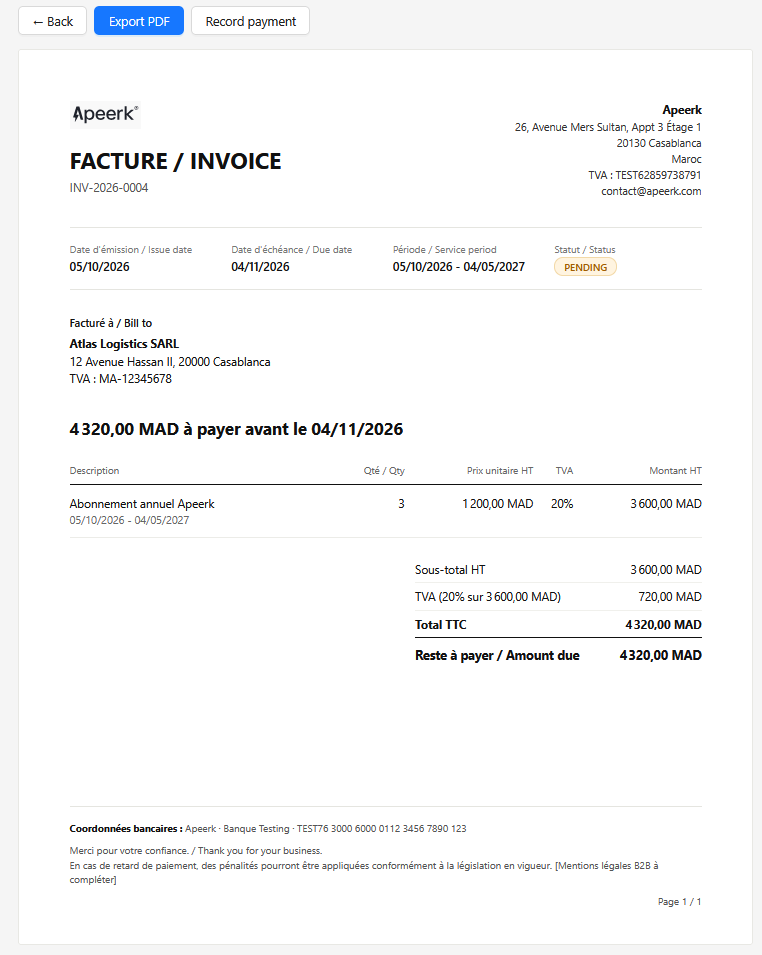
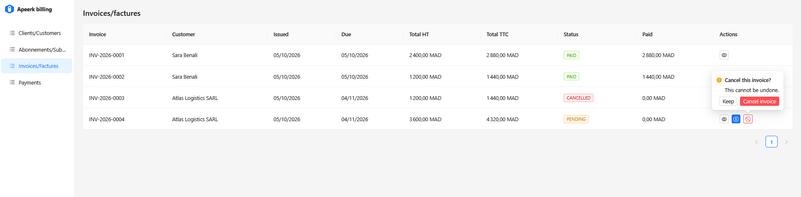

# Apeerk Billing

Application web simplifiée de gestion d'abonnements et de facturation pour Apeerk. Un responsable des ventes peut gérer tout le cycle de vie client : créer un client, lui souscrire un abonnement annuel, obtenir une facture générée automatiquement, enregistrer les règlements, puis imprimer la facture en PDF.

[](docs/screenshots/invoice.png)
[](docs/screenshots/invoices-list.png)

English version: [README.en.md](README.en.md)

## Stack technique

| Couche | Technologie |
|---|---|
| Base de données | PostgreSQL 16 |
| API | Hasura GraphQL Engine v2.48 |
| Frontend | Next.js (App Router), React 19 |
| Framework admin | Refine + provider de données `@refinedev/hasura` |
| Interface | Ant Design 5 (`@refinedev/antd`) |
| Runtime / gestionnaire de paquets | Bun |

L'authentification est hors périmètre de cet exercice, conformément au cahier des charges.

## Prérequis

- [Docker Desktop](https://www.docker.com/products/docker-desktop/) (lancé)
- [Hasura CLI](https://hasura.io/docs/2.0/hasura-cli/install-hasura-cli/) v2 (nécessaire uniquement pour charger les données de démonstration)
- [Bun](https://bun.sh/)

## Démarrage rapide

```bash
# 1. Variables d'environnement pour Docker (PowerShell : Copy-Item .env.example .env)
cp .env.example .env

# 2. Démarrer PostgreSQL + Hasura (schéma et métadonnées appliqués automatiquement)
docker compose up -d
# attendre environ 40 secondes : Hasura applique les migrations avant d'écouter

# 3. Données de démonstration (1 produit, 2 clients, 1 abonnement avec sa facture)
cd hasura
hasura seed apply --database-name default
cd ..

# 4. Application web
cd web
cp .env.example .env.local
bun install
bun dev
```

Ensuite, ouvrir :

- Application : <http://localhost:3000>
- Contrôle de santé de Hasura : <http://localhost:8080/healthz> (doit afficher `OK`)
- Console Hasura (optionnelle) : lancer `hasura console` depuis `hasura/`, puis ouvrir <http://localhost:9695>. Utiliser celle-ci plutôt que `localhost:8080/console`, car elle écrit les modifications dans `metadata/` et `migrations/`.

Pour repartir d'une base propre : `docker compose down -v`, puis refaire les étapes 2 et 3.

## Cycle de vie

```
client -> abonnement -> facture (PENDING) -> règlement(s) -> facture (PAID)
```

1. **Client.** Un client B2B doit avoir un numéro de TVA, vérifié dans le formulaire et par une contrainte `CHECK` en base. Un client B2C n'en a pas besoin.
2. **Abonnement.** Associe un client au produit, avec une période et une quantité. Le prix unitaire est copié depuis le produit au moment de la souscription (instantané du prix) : un changement de prix ultérieur ne modifie pas les contrats existants.
3. **Facture.** Générée automatiquement par un trigger en base à la création de l'abonnement :
   - `total_ht = quantité x prix unitaire`, `total_ttc = total_ht x 1,20`
   - numéro issu d'une séquence (`INV-2026-0001`)
   - échéance : date d'émission + 30 jours en B2B, même jour en B2C
   - statut `PENDING`
4. **Règlement.** Enregistré sur une facture en attente. Quand les règlements couvrent le total, la facture passe automatiquement à `PAID`. Les paiements partiels sont gérés.

**B2B et B2C.** La seule différence est le calendrier. Une facture B2B reste `PENDING` jusqu'à la réception du virement. En B2C ou en espèces, le règlement s'enregistre juste après la création de l'abonnement, avec le bouton **Record payment** de la nouvelle facture, et la facture passe immédiatement à `PAID`.

## Facture et PDF

Ouvrir **Invoices > View** sur une facture. La mise en page reprend l'exemple Anthropic du cahier des charges : en-tête minimaliste, grille de métadonnées, bloc de facturation, tableau des lignes, totaux alignés à droite avec l'historique des règlements, pied de page avec les coordonnées bancaires.

Cliquer sur **Print / Save as PDF**. Dans la boîte de dialogue d'impression du navigateur, choisir **Enregistrer au format PDF** comme destination, le format **A4**, et activer **Graphiques d'arrière-plan** pour conserver la couleur du badge de statut. Une feuille de style d'impression masque l'interface de l'application : seule la facture est exportée.

## Structure du projet

```
apeerk-billing/
├── docker-compose.yml        PostgreSQL + Hasura
├── .env.example
├── hasura/
│   ├── config.yaml
│   ├── migrations/default/   schéma, triggers (appliqués automatiquement au démarrage)
│   ├── metadata/             tables suivies, relations, enums
│   └── seeds/default/        données de démonstration
└── web/                      application Next.js + Refine
    └── src/
        ├── app/              pages clients, abonnements, factures, règlements
        ├── components/invoice/   template de facture et CSS d'impression
        ├── providers/        provider de données Hasura
        └── lib/              constantes (taux de TVA, émetteur), formatage
```

## Règles métier appliquées en base

Les règles résident dans des triggers PostgreSQL : aucun formulaire ni appel d'API ne peut les contourner.

| Règle | Mécanisme |
|---|---|
| Un client B2B exige un numéro de TVA | Contrainte `CHECK` |
| Le prix de l'abonnement est copié depuis le produit | Trigger `BEFORE INSERT` |
| La facture est générée à partir de l'abonnement | Trigger `AFTER INSERT` |
| Règlements uniquement sur facture `PENDING`, jamais au-delà du solde restant | Trigger `BEFORE INSERT` avec verrou de ligne |
| La facture passe à `PAID` quand elle est entièrement couverte, et revient à `PENDING` si un règlement est supprimé | Trigger `AFTER INSERT/DELETE` |
| Les règlements et les abonnements ne sont pas modifiables | Triggers `BEFORE UPDATE` |
| Les montants et le numéro d'une facture sont immuables ; une facture en attente et non réglée peut être annulée, et l'annulation est définitive | Trigger `BEFORE UPDATE` |

Les valeurs de référence (`customer_type`, `invoice_status`, `payment_mode`) sont des tables enum Hasura : elles apparaissent comme de vrais enums GraphQL.

## Hypothèses et choix de conception

- **Taux de TVA : 20 %.** Le cahier des charges n'en précise pas. L'exemple Anthropic affiche 20 % pour le Maroc. Le taux est défini dans le trigger de facturation et repris par `VAT_RATE` dans `web/src/lib/constants.ts`.
- **Devise : MAD.** Non précisée dans le cahier des charges. Modifiable via `CURRENCY` dans `web/src/lib/constants.ts`.
- **Les coordonnées de l'émetteur et de la banque sont des valeurs fictives** (`ISSUER`, `BANK` dans `constants.ts`) et doivent être remplacées par les vraies informations légales d'Apeerk. Le logo est un SVG provisoire dans `web/public/`.
- **Numéros de facture** issus d'une séquence PostgreSQL : uniques et sans conflit en cas d'accès concurrent, mais le compteur ne repart pas à zéro chaque année et un numéro n'est jamais réutilisé.
- **Pas d'authentification**, conformément au cahier des charges. L'application web appelle Hasura avec le secret administrateur depuis le navigateur (variable `NEXT_PUBLIC_`). C'est un choix délibéré pour une démonstration locale, qui **ne doit pas être utilisé en production** : il faudrait alors des rôles, des permissions et un proxy côté serveur.
- **Impression navigateur pour le PDF** plutôt qu'un générateur côté serveur : aucune dépendance supplémentaire, texte sélectionnable, et utilisation de la feuille de style d'impression. Le pied de page affiche un « Page 1 / 1 » statique, car une facture à une seule ligne tient toujours sur une page.
- **Dates** calculées dans le fuseau horaire du serveur de base de données (UTC) : près de minuit, une date d'émission peut différer d'un jour par rapport à l'heure du Maroc.

## Dépannage

- **Hasura est injoignable juste après `docker compose up`.** L'image `cli-migrations` applique d'abord les migrations, puis démarre le serveur. Attendre environ 40 secondes et vérifier `docker compose ps` et `http://localhost:8080/healthz`.
- **`hasura seed apply` échoue avec une erreur de clé dupliquée.** Les données existent déjà. Le seed est écrit pour pouvoir être relancé, mais si vous l'avez modifié, réinitialisez avec `docker compose down -v`.
- **Les versions de certaines dépendances sont figées volontairement.** `@refinedev/hasura` exige `graphql-request@^5` et `graphql@^15`. Des versions plus récentes provoquent une erreur de types dupliqués.
- **`@ant-design/v5-patch-for-react-19`** est installé car Ant Design 5 supporte officiellement React jusqu'à la version 18, alors que Next.js fournit React 19.
- **Un avertissement `Menu children is deprecated` apparaît en mode développement.** Il provient de `@refinedev/antd` et est sans conséquence.

## Pistes d'amélioration

- Une vraie authentification, avec des rôles et permissions Hasura à la place du secret administrateur.
- Un parcours en une étape « créer l'abonnement et encaisser » pour le B2C.
- Génération de PDF côté serveur et factures multi-pages.
- Plusieurs lignes par facture et règles de TVA par client.
- Des tests automatisés pour la logique des triggers.
- Un Dockerfile pour l'application web, afin de tout démarrer avec une seule commande.